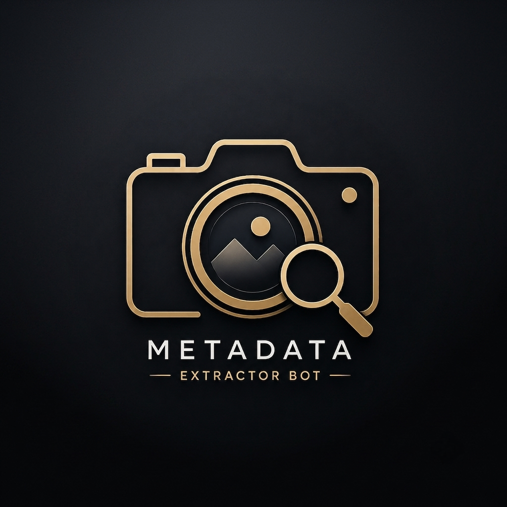

# Metadata Extractor Bot

<p align="center">
  
</p>

<p align="center">
  <b>🔍 Extract hidden metadata and EXIF information from images directly in Telegram.</b>
</p>

## ✨ Features

- 📷 Extracts EXIF and image metadata
- 📱 Camera and device information
- 📅 Date and time information
- 📐 Image dimensions and resolution
- 🔭 Lens, ISO, aperture and shutter speed
- 📍 GPS coordinates when available
- 🗺️ Google Maps location links for GPS metadata
- 📄 Supports Telegram photos and image documents
- ⚡ Asynchronous processing for fast responses
- 🔐 Private-message only operation
- 📢 Force-join protection
- ☁️ Ready for deployment on Render

## 🚀 Deployment

### 1. Clone the repository

```bash
git clone <YOUR_REPOSITORY_URL>
cd <YOUR_REPOSITORY_NAME>
```

### 2. Install dependencies

```bash
pip install -r requirements.txt
```

### 3. Set the bot token

Set the `BOT_TOKEN` environment variable with your Telegram bot token.

### 4. Run

```bash
python bot.py
```

## ☁️ Render

This project includes `render.yaml` for Render deployment.

Add the following environment variable:

```text
BOT_TOKEN=your_telegram_bot_token
```

The application also exposes a lightweight Flask health endpoint for uptime monitoring.

## 📦 Project Structure

```text
.
├── bot.py
├── requirements.txt
├── render.yaml
├── metadata.png
├── README.md
└── LICENSE
```

## 🛠️ Requirements

- Python 3.11+
- Telegram Bot Token
- Pillow
- python-telegram-bot
- Flask

## 🔒 Privacy

Metadata is processed only to generate the requested result. Users should avoid uploading images containing sensitive information they do not want processed.

## 📜 License

This project is released under the MIT License. See [`LICENSE`](LICENSE) for details.

---

<p align="center">
  Made with ❤️ for Telegram
</p>
